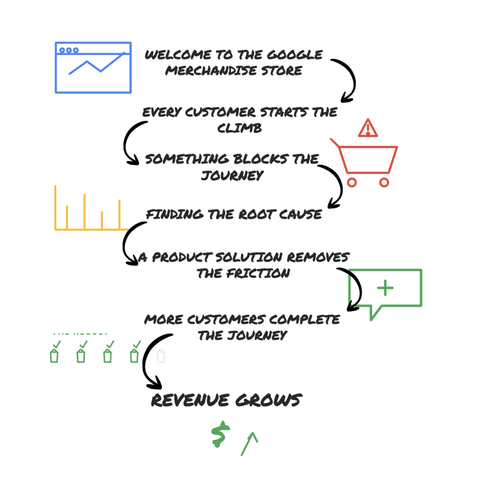

<div align="center">

# Google Merchandise Store: Diagnosing a Revenue Decline

</div>

---

# Business Problem

The Google Merchandise Store experienced a decline in revenue despite continued customer activity.

At first glance, it was unclear **why revenue was falling**. Was the business attracting fewer visitors? Were customers abandoning their carts? Was the issue seasonal, behavioral, or something else entirely?

Instead of jumping to conclusions, this project approaches the problem the way a Business Analyst or Product Analyst would—by investigating the complete customer journey, validating findings with statistics, and transforming insights into a product recommendation.

<p align="center">

</p>


|---|---|
| **Dataset** | [`bigquery-public-data.ga4_obfuscated_sample_ecommerce`](https://console.cloud.google.com/bigquery) |
| **Scope** | Nov 1, 2020 – Jan 31, 2021 · 267,116 sessions · $362,165 revenue |
| **Skills** | SQL (BigQuery), hypothesis testing, correlation analysis, funnel analysis, product strategy |

---


## Methodology

The investigation moved through five phases — all code lives in [`analysis.py`](analysis.py).


| Phase | Business Question |
|---|---|
| **1. Data Exploration** | What events exist? What does the schema look like? |
| **2. Funnel Diagnostics** | Is the decline driven by traffic or conversion? Where's the drop-off? |
| **3. Segmentation** | Does it vary by channel, device, geography, or user type? |
| **4. Statistical Validation** | Is the decline real? Isolated to one segment? *(see [Statistical Model](STATISTICAL_MODEL.md))* |
| **5. Product-Level Analysis** | Are specific products underperforming? |

**Known data caveats**, identified and handled in the code:
- `transaction_id` is frequently null on `purchase` events → revenue queries filter on `ecommerce.purchase_revenue IS NOT NULL` instead
- `traffic_source.medium` occasionally shows `(data deleted)` (a GA4 privacy redaction) → excluded from channel-level conclusions
- November shows `add_to_cart` counts lower than `begin_checkout` counts in aggregate → flagged as a likely non-cart checkout path, not a real >100% conversion

---

## Key Findings

| # | Finding | Evidence |
|---|---|---|
| 1 | Revenue decline is **conversion-driven**, not traffic-driven | Sessions held flat (~2,300–4,600/day); conversion fell 1.73% → 0.89% (Dec→Jan) |
| 2 | The funnel's largest leak is **before checkout** | Only 23% of sessions view a product; checkout-to-purchase is a healthy 42% |
| 3 | The decline is **statistically significant** | t = 4.332, p = 0.00006 |
| 4 | The decline is **seasonal**, not a broken feature | Desktop/mobile conversion correlate at r = 0.81 |
| 5 | **Paid traffic underperforms** free traffic, every month | CPC converts lowest of all channels, Nov–Jan without exception |
| 6 | **Returning customers convert 5.3x better** | 6.67% vs. 1.25% conversion |
| 7 | Geography & device **don't** explain the pattern | Conversion uniform ~1.2–1.9%; AOV flat ~$67–70 |
| 8 | Cart abandonment (67.6%) is **industry-normal** | Typical benchmark is ~70% — no urgent fix needed |

Full statistical methodology, formulas, and interpretation: **[docs/STATISTICAL_MODEL.md](docs/STATISTICAL_MODEL.md)**

---

## Live Dashboard

[](https://public.tableau.com/views/G4RevenueAnalytics/Dashboard2)

**[→ Open the live dashboard on Tableau Public](https://public.tableau.com/views/G4RevenueAnalytics/Dashboard2)** — filter by month, channel, and device directly.

---

## Repository Structure

```
├── README.md
├── analysis.py                          ← all SQL queries + Python statistical functions
├── docs/
│   └── STATISTICAL_MODEL.md             ← formulas, methodology, assumptions, interpretation
├── assets/
│   └── story/                           ← the 7 story panels shown above
└── deliverables/
    ├── GA4_Full_Presentation.pptx       ← problem → analysis → solution → personas → wireframes → forecast → metrics
    ├── GA4_Discovery_Assistant_Proposal.pdf   ← diagnosis → behavioral product solution → GTM strategy
    ├── GA4_Revenue_Funnel_GTM_Strategy.pptx
    ├── GA4_Revenue_to_Solution_Overview.pptx  ← condensed 8-slide summary
    └── GA4_Business_Summary.pdf          ← 3-page executive summary
```

---

## Deliverables

| Resource | Link |
|---|---|
| Interactive live dashboard | **[Tableau Public](https://public.tableau.com/views/G4RevenueAnalytics/Dashboard2)** |
| Full presentation deck | [`deliverables/GA4_Full_Presentation.pptx`](deliverables/GA4_Full_Presentation.pptx) |
| Product solution proposal | [`deliverables/GA4_Discovery_Assistant_Proposal.pdf`](deliverables/GA4_Discovery_Assistant_Proposal.pdf) |
| GTM strategy deck | [`deliverables/GA4_Revenue_Funnel_GTM_Strategy.pptx`](deliverables/GA4_Revenue_Funnel_GTM_Strategy.pptx) |
| Condensed summary deck | [`deliverables/GA4_Revenue_to_Solution_Overview.pptx`](deliverables/GA4_Revenue_to_Solution_Overview.pptx) |
| Executive summary (3 pages) | [`deliverables/GA4_Business_Summary.pdf`](deliverables/GA4_Business_Summary.pdf) |
| Statistical model & formulas | [`STATISTICAL_MODEL.md`](STATISTICAL_MODEL.md) |
| All code (SQL + Python) | [`analysis.py`](analysis.py) |

---

## How to Reproduce

1. Create a free [Kaggle](https://kaggle.com) account and open a new Notebook (free BigQuery public dataset access, no billing setup needed)
2. Upload `analysis.py` and import the query strings / functions you need:
   ```python
   from google.cloud import bigquery
   client = bigquery.Client()

   from analysis import Q5_FULL_FUNNEL
   df_funnel = client.query(Q5_FULL_FUNNEL).to_dataframe()
   ```
3. For Phase 4 statistical functions, build `df_master` (one row per date/device/channel with a `conversion_rate` column) from your Phase 2/3 query results, then call e.g. `run_ttest_dec_vs_jan(df_master)`
4. `scipy` and `scikit-learn` are pre-installed on Kaggle

---

## Technologies

Google BigQuery · SQL · Python (pandas, scipy, scikit-learn) · Tableau · Figma

---

## Skills Demonstrated

Business analysis · Product analytics · Revenue analytics · Funnel analysis · Statistical hypothesis testing · SQL · Python · Data storytelling · Product strategy

---

<div align="center">

*Analysis performed using Google BigQuery (SQL), Python (pandas, scipy, scikit-learn), and Tableau/Figma for visualization.*

</div>